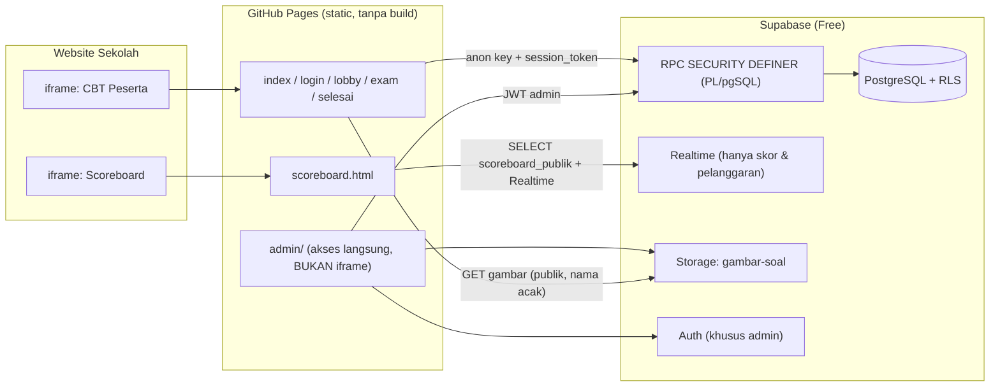

# Fase 0 — Planning: Dashboard Olimpiade Al Ishlah Gorontalo (CBT + Live Score)

## 1. Gambaran Arsitektur

**Prinsip inti**
- Peserta **bukan** user Supabase Auth. Mereka hanya memanggil RPC dengan `session_token` (token acak 32 byte).
- Di DB hanya disimpan **hash SHA-256 token** (`session_token_hash`), bukan token mentah → kebocoran DB tidak langsung bisa dipakai membajak sesi.
- Semua fungsi pembantu internal diletakkan di schema `private` (tidak diekspos PostgREST). Hanya fungsi RPC publik di schema `public`.
- `EXECUTE` dicabut dari `PUBLIC` secara default; lalu di-`GRANT` eksplisit: RPC peserta → `anon, authenticated`; RPC admin → `authenticated` saja (+ cek `private.is_admin()` di dalam fungsi).

---

## 2. Kode Cabang & Config

Kode cabang (CHECK constraint): `MTK`, `PAI`, `IPA`, `BING`.

Tabel `config (key text PK, value jsonb, updated_at)`:

| key | contoh value | keterangan |
|---|---|---|
| `nama_event` | `"Olimpiade Al Ishlah Gorontalo 2026"` | |
| `cabang_MTK` (dst. per cabang) | `{nama, durasi_menit:90, buka, tutup, skor_benar:4, skor_salah:-1, skor_kosong:0, acak_soal:true, acak_opsi:true, aktif:true}` | jadwal = jendela **mulai** ujian |
| `pelanggaran` | `{batas_peringatan:2, batas_maks:3, tindakan_maks:"submit"\|"kunci", debounce_detik:3}` | |
| `scoreboard` | `{publik:false, top_n:20, tampilkan_sekolah:true}` | |
| `kunci_darurat` | `false` | true → login/mulai/simpan ditolak |
| `sistem` | `{grace_detik:10, token_jam:6, login_maks_gagal:5, login_kunci_menit:5, heartbeat_detik:25}` | |

Anon **tidak** membaca `config` langsung; memakai RPC `info_publik()` yang hanya mengembalikan subset aman.

---

## 3. Skema Tabel (ringkas)

| Tabel | Kolom utama | Catatan |
|---|---|---|
| `admins` | `user_id uuid PK → auth.users` | |
| `peserta` | `id uuid, cabang, nama, asal_sekolah, username (unik, lowercase), password_hash, status (belum/mengerjakan/selesai/terkunci), session_token_hash, session_expires, last_seen, gagal_login, kunci_login_sampai, created_at` | `password_hash` & `session_token_hash` dicabut dari SELECT admin (column privilege) |
| `soal` | `id uuid, cabang, no, tipe (PG/PG_KOMPLEKS/ISIAN), teks_soal, gambar_soal, opsi_a..e, gambar_opsi_a..e, bobot numeric default 1, pembahasan, updated_at` | unik `(cabang, no)` |
| `kunci_soal` | `soal_id PK → soal ON DELETE CASCADE, kunci text` | **tanpa policy anon**; admin baca via RLS `is_admin()` |
| `sesi` | `id, peserta_id (UNIK = 1x per cabang), cabang, waktu_mulai, waktu_selesai, waktu_submit, status (berjalan/selesai/terkunci), urutan_soal jsonb, urutan_opsi jsonb, jumlah_pelanggaran, tambahan_detik, submit_oleh` | `submit_oleh`: peserta / waktu_habis / pelanggaran / admin |
| `jawaban` | `PK(sesi_id, soal_id), jawaban text, ragu bool, updated_at` | upsert |
| `skor` | `id bigint identity, peserta_id UNIK, nama, sekolah, cabang, benar, salah, kosong, skor_akhir, durasi_detik, waktu_submit, jumlah_pelanggaran, submit_oleh` | hanya admin |
| `scoreboard_publik` | `id (= skor.id), nama, sekolah, cabang, skor_akhir, durasi_detik, waktu_submit` | **TABEL** (bukan view) agar bisa Realtime; disinkron trigger dari `skor`; tanpa `peserta_id` |
| `pelanggaran` | `id bigint, waktu (server), peserta_id, sesi_id, jenis, detail, urutan_ke, tindakan` | |
| `log_admin` | `id, waktu, admin_id, aksi, detail jsonb` | |

**Index**: `peserta(cabang)`, `peserta(session_token_hash)`, `soal(cabang,no)`, `sesi(cabang,status)`, `jawaban(sesi_id)`, `skor(cabang, skor_akhir desc, durasi_detik, waktu_submit)`, `scoreboard_publik(cabang, skor_akhir desc, ...)`, `pelanggaran(peserta_id)`, `pelanggaran(sesi_id)`, `pelanggaran(waktu desc)`.

**Storage** bucket `gambar-soal`: baca publik; `insert/update/delete` pada `storage.objects` hanya bila `private.is_admin()`. Path `{cabang}/{uuid}.webp` (nama acak, tak bisa ditebak).

---

## 4. Kebijakan RLS

| Tabel | anon | authenticated (admin) |
|---|---|---|
| `config`, `admins`, `peserta`, `soal`, `kunci_soal`, `sesi`, `jawaban`, `skor`, `pelanggaran`, `log_admin` | **tidak ada policy** (ditolak) | `SELECT` bila `is_admin()`; penulisan **hanya via RPC admin** (agar tercatat di `log_admin`) |
| `scoreboard_publik` | `SELECT` bila `config.scoreboard.publik = true` | `SELECT` selalu bila `is_admin()` |
| `storage.objects` (bucket `gambar-soal`) | `SELECT` | tulis bila `is_admin()` |

Fungsi RPC `SECURITY DEFINER` (owner `postgres`) melewati RLS secara terkontrol.

---

## 5. Daftar RPC

### Publik / Peserta (`anon, authenticated`)

| RPC | Input | Output | Logika server |
|---|---|---|---|
| `info_publik()` | – | nama event, jadwal & durasi per cabang, status scoreboard | subset config aman |
| `peserta_login` | `p_username, p_password` | `{ok, token, peserta{nama,cabang,status}, pesan}` | cek kunci darurat; rate limit 5 gagal → kunci 5 mnt; `crypt()` bcrypt; token baru (memutus sesi lama). Jika sesi lama masih aktif (`last_seen` < 60 dtk) → catat pelanggaran `login_ganda`. Pesan gagal seragam (anti enumerasi username) |
| `peserta_info` | `p_token` | data peserta, cabang, status, jadwal, durasi, aturan pelanggaran, status sesi | |
| `mulai_ujian` | `p_token` | `{ok, sesi_id, sisa_detik}` | cek jendela waktu, belum pernah; buat sesi, `waktu_selesai = now() + durasi`; acak & simpan urutan soal/opsi. Idempoten (jika sesi berjalan → kembalikan sesi itu) |
| `ambil_soal` | `p_token` | `{soal[] (urutan acak, opsi teracak, TANPA kunci), jawaban_tersimpan[], sisa_detik, pelanggaran}` | dipanggil sekali di awal / saat resume |
| `simpan_jawaban` | `p_token, p_soal_id, p_jawaban, p_ragu` | `{ok, sisa_detik}` | tolak bila `now() > waktu_selesai + grace` / bukan berjalan / soal bukan milik sesi; 1 upsert |
| `simpan_jawaban_batch` | `p_token, p_items jsonb` | `{ok, tersimpan[], sisa_detik}` | untuk antrean offline (kirim beberapa sekaligus) |
| `catat_pelanggaran` | `p_token, p_jenis, p_detail` | `{tindakan: peringatan/submit/kunci, urutan_ke, sisa_peringatan}` | debounce server (abaikan jenis sama < N detik), terapkan kebijakan config |
| `heartbeat` | `p_token` | `{status, sisa_detik, server_time}` | update `last_seen`; finalisasi otomatis bila waktu habis |
| `submit_ujian` | `p_token` | `{ok, status}` (skor tidak ditampilkan ke peserta kecuali dikonfigurasi) | penilaian server, tulis `skor` + `scoreboard_publik`; idempoten |
| `peserta_logout` | `p_token` | `{ok}` | hapus token |

### Admin (`authenticated` + `is_admin()`; semua mencatat `log_admin`)

| RPC | Fungsi |
|---|---|
| `admin_import_peserta(p_cabang, p_rows jsonb)` | batch ±50; validasi; bcrypt server; laporan per baris |
| `admin_import_soal(p_cabang, p_rows jsonb, p_mode 'tambah'\|'ganti')` | soal + kunci (tabel terpisah); laporan per baris |
| `admin_simpan_peserta`, `admin_hapus_peserta`, `admin_reset_password` | CRUD |
| `admin_simpan_soal`, `admin_hapus_soal`, `admin_duplikat_soal`, `admin_urutkan_soal` | CRUD soal |
| `admin_reset_sesi`, `admin_buka_kunci`, `admin_kunci_peserta`, `admin_tambah_waktu(p_peserta_ids[], p_menit, p_alasan)`, `admin_paksa_submit` | aksi pengawasan (alasan wajib) |
| `admin_simpan_config(p_key, p_value)` | pengaturan ujian |
| `admin_dashboard()` | ringkasan per cabang |
| `admin_monitoring(p_cabang)` | status, progres jawaban, sisa waktu, pelanggaran, last seen |
| `admin_rekap(p_cabang)` / `admin_log_pelanggaran(filter)` | ekspor |
| `admin_finalisasi_kedaluwarsa()` | submit otomatis sesi yang waktunya habis tapi browser tertutup |

**Finalisasi sesi kedaluwarsa** (peserta menutup browser saat waktu habis): (1) lazy saat RPC apa pun dipanggil, (2) `pg_cron` tiap menit **jika tersedia** (dipasang opsional dalam migration), (3) dipicu juga oleh polling monitoring admin.

---

## 6. Aturan Penilaian (asumsi default — lihat Pertanyaan #2)

- **Benar**: `skor_benar × bobot` · **Salah**: `skor_salah` · **Kosong**: `skor_kosong`.
- **PG**: cocok persis huruf.
- **PG_KOMPLEKS**: kunci `A,C` → himpunan harus sama persis (all-or-nothing).
- **ISIAN**: beberapa jawaban benar dipisah `|`; normalisasi (trim, lowercase, spasi ganda); jika keduanya angka → bandingkan numerik (`0,5` = `0.5`).
- Ranking: `skor_akhir DESC`, `durasi_detik ASC`, `waktu_submit ASC`.

---

## 7. Frontend (ringkas)

- **Halaman peserta**: `index.html` (landing + iframe-guard) → `login.html` → `lobby.html` (Tes Perangkat + aturan + tombol mulai) → `exam.html` → `selesai.html`.
- **Modul JS**: `config.js`, `supabase-client.js`, `storage-safe.js` (sessionStorage → fallback memori, semua try/catch), `iframe-guard.js`, `auth.js`, `exam.js`, `security.js`, `render.js` (escape HTML + KaTeX aman, `trust:false`), `scoreboard.js`, `admin-*.js`.
- **Autosave**: debounce 800 ms → antrean → retry exponential backoff + jitter; indikator "Tersimpan / Menyimpan / Offline (n antrean)".
- **Opsi teracak**: dikirim sebagai `[{kode asli, teks, gambar}]` dalam urutan acak; label tampilan A–E posisional; jawaban dikirim sebagai kode asli.
- **Admin**: SPA ringan dengan tab (Dashboard, Peserta, Soal, Pengaturan, Monitoring, Pelanggaran, Hasil). SheetJS untuk CSV/XLSX, kompresi gambar via `<canvas>` → WebP (maks 1280 px, target ≤ 300 KB), editor LaTeX dengan live preview + toolbar simbol.
- **Impor gambar massal soal**: admin upload banyak gambar sekaligus, lalu kolom `gambar_soal` di CSV boleh berisi **nama file** (dipetakan otomatis ke URL Storage) atau URL penuh.
- **Tema**: hijau zamrud + emas lembut, font Inter/Plus Jakarta Sans, ornamen geometris Islami tipis, kontras AA.

---

## 8. Realtime & Kinerja

| Komponen | Mekanisme |
|---|---|
| Peserta | **tanpa Realtime**; RPC pendek; heartbeat 25 dtk (+ jitter) |
| Scoreboard | Realtime `scoreboard_publik` + fallback polling 10 dtk |
| Monitoring admin | Realtime `skor` & `pelanggaran` (event jarang) + polling `admin_monitoring` 10 dtk untuk progres/last_seen |

> Alasan monitoring tidak me-Realtime `peserta/sesi`: heartbeat 500 peserta ≈ 20 update/detik → membanjiri kuota pesan Realtime. Polling 1 query agregat per 10 dtk jauh lebih hemat.

- Estimasi beban puncak: ~20 heartbeat/dtk + ~15–30 simpan/dtk → aman untuk Postgres free tier jika query ber-index.
- bcrypt **cost 8** (≈ 15–25 ms/verifikasi) agar lonjakan 500 login & impor batch 50 baris tidak melebihi `statement_timeout` (anon ±3 dtk, authenticated ±8 dtk di Supabase).
- Jitter acak 0–4 dtk pada tombol "Mulai Ujian".

---

## 9. Risiko & Mitigasi

| Risiko | Mitigasi |
|---|---|
| **Kuota free tier** (egress ±5 GB, DB 500 MB, Realtime ±200 koneksi, proyek dijeda setelah ±7 hari tidak aktif) | Kompres gambar, cache-control panjang; Realtime hanya admin/scoreboard; README: cek ulang batas terkini, aktifkan & uji H-3 |
| Egress gambar (500 peserta × banyak gambar) | WebP kecil, `ambil_soal` sekali; opsi gelombang per cabang |
| **Fullscreen ditolak di iframe** / iPhone tidak mendukung Fullscreen API | Tombol "Buka Ujian di Tab Penuh"; mode tab penuh tetap memantau visibility/blur |
| **Storage terpartisi** (Safari ITP) | sessionStorage + fallback memori; pesan jelas + saran tab penuh |
| False-positive fokus (klik ke halaman induk, popup website sekolah) | Debounce client + server, peringatan bertingkat, rekomendasi halaman iframe bersih |
| Soal bocor via URL gambar publik | Nama file UUID acak; teks soal hanya dikirim setelah `mulai_ujian` |
| Soal diedit saat ujian berjalan | Admin diberi peringatan/blokir edit bila cabang punya sesi berjalan |
| Cache GitHub Pages (±10 mnt) | Versioning query string `?v=` pada JS/CSS |
| Anon key publik | Memang by design; semua tabel sensitif RLS-deny, akses lewat RPC tervalidasi |
| Batas keamanan browser | Dinyatakan jujur di README; wajib pengawas ruang |

---

## 10. Asumsi Default (berlaku bila tidak dijawab)

1. 1 akun = 1 cabang; siswa yang ikut 2 cabang mendapat 2 akun.
2. Penilaian seperti §6 (PG_KOMPLEKS all-or-nothing).
3. Perangkat campuran (lab komputer + laptop/HP); di HP fullscreen tidak dipaksakan, diganti mode tab penuh + deteksi visibility.
4. Kebijakan pelanggaran default: ke-1–2 peringatan, ke-3 **auto-submit** (dapat diubah ke "kunci").
5. Skor tidak ditampilkan ke peserta di `selesai.html` (bisa diaktifkan via config).
6. Scoreboard publik default **off**; admin menyalakan manual.
7. Kunci darurat tidak menjeda timer; admin memakai "tambah waktu massal" setelahnya.
8. Grace period simpan jawaban 10 detik setelah `waktu_selesai` (toleransi jaringan).
9. Token peserta berlaku 6 jam sejak login.

---

## 11. Rencana Fase

| Fase | Output |
|---|---|
| 1 | `supabase/migrations/001_init.sql`, `supabase/seed_demo.sql`, panduan uji di SQL Editor |
| 2 | `admin/` (login, dashboard, peserta, soal + LaTeX + gambar, pengaturan), `templates/*.csv` |
| 3 | Halaman peserta, `security.js`, `iframe-guard.js`, autosave, submit |
| 4 | Monitoring live, log pelanggaran, `scoreboard.html`, ekspor CSV/XLSX |
| 5 | `loadtest/` (Node.js tanpa dependensi, `fetch` ke RPC), `README.md`, review keamanan |
